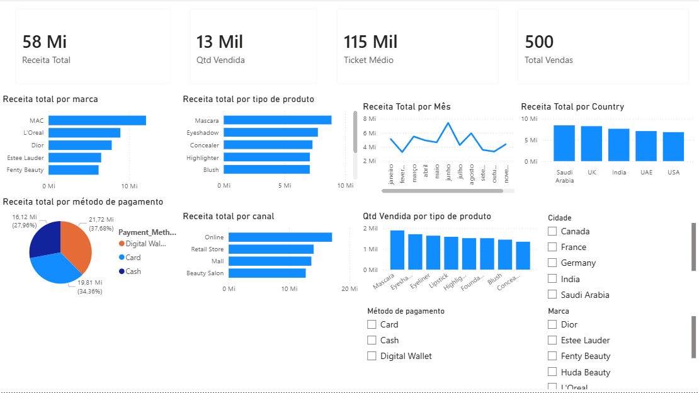

##  Dashboard interativo desenvolvido no Power BI:

Visão geral do dashboard desenvolvido:

Dashboard de Vendas de Maquiagem 2025

Este projeto apresenta um dashboard interativo desenvolvido no Power BI com o objetivo de analisar o desempenho de vendas no setor de cosméticos.

* Objetivo

Analisar o comportamento das vendas e gerar insights relevantes para apoio na tomada de decisão.

* Base de Dados

O dataset contém informações como:

Data das vendas
Marca dos produtos
Tipo de produto
País
Canal de vendas
Método de pagamento
Quantidade vendida
Receita (USD)

* Principais Métricas
* Receita Total
* Quantidade Vendida
* Número de Vendas
* Ticket Médio
* Análises Realizadas

Receita ao longo do tempo (mensal)
Top 5 marcas por faturamento
Produtos mais vendidos
Receita por país
Análise por canal de vendas
Distribuição por método de pagamento

 Insights
- Marcas líderes concentram a maior parte do faturamento
- Alguns produtos apresentam maior volume de vendas
- O canal online tem forte impacto nas receitas
- Métodos digitais de pagamento são predominantes

